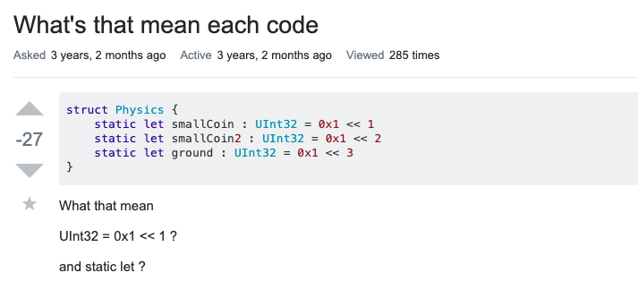
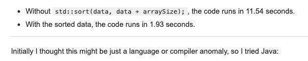

# The Question Plague #
I always grew up being told, "There's no such thing as a stupid question." However, I've also heard, "Think before you talk." So which is the correct? Well, when it comes to asking a question there can be two approaches: the "smart" way or the "not so smart" way. Simply put, it's how you word it that can make a world a difference. Having a poorly worded question can make others think that the asker is asking for A, but in actuality they may be asking for Z. This in turn, makes the answer much harder and longer to get to. This is negatively affecting both the individual that asked the question and the one that answered. It's a road that leads to nowhere.

# The More Detail the Better Right? #
Well, yes, but also no. We need to realize what information is relevant to the question and what isn't. If I attach a whole monologue to a question that can be asked and answered in 10 second with the information that's needed, then why do so? However, lack of information is always an issue. If we look at this user's [question](https://stackoverflow.com/questions/37913482/whats-that-mean-each-code) on StackOverFlow, we can see how poorly worded it is. The post itself has 27 down votes and a single answer that only solves a tiny portion of their question. 

  

The user's title is "What's that mean each code" and their only questions are "What that mean," and "and static let ?" This leaves little information for any responder to reply with a proper answer. There is no information about what the exact issue is aside from, "UInt32 = 0x1 << 1 ?" and "and static let ?". There's nothing about what they specifically don't understand since the title lacks any information in the title and the body. Someone was kind enough to give an example of what the "<<" does within the code itself, but that was the post's only response. A question that's poorly done gives off the impression that the individual asking the question doesn't want to put effort into trying to learn something new. So why should anyone give even more effort to explain something to that individual?

# Getting it Right #
How can a question be done right? Well, that's a little complicated. Since having <i>too</i> much information or having <i>too</i> little can be a detriment, it can be hard to pinpoint what's exactly relevant if we're confused in the first place, but let's look at [one](https://stackoverflow.com/questions/11227809/why-is-processing-a-sorted-array-faster-than-processing-an-unsorted-array) that's asked in an excellent way. If we look at the post's title we get the question that they want answered right away: Why is processing a sorted array faster than processing an unsorted array? In addition to this, the very first thing the user write's in the body is, "Here is a piece of C++ code that shows some very peculiar behavior." They provide the exact code for what their question pertains to. Then, they specifically talk about how the code manipulates the code and data that it's working on. 

  

To highlight on this specific screen shot of the post, the user makes an effort to test their code on a different platform to try and answer their own assumption that it may just be due to the language they're using. However, they tested it with Java and the result was also similar. Posing a question in this manner shows exactly what a good question can include. Initial thoughts, tests, and an initiative to want to learn on why the thing that's bothering them is happening in the first place. Answering a question for someone who has clearly laid out the foundation on their thought process can be made a whole lot easier with the information provided, such like this post. Since there's also clearly a lot of thought put into forming the question and laying out the results, someone can answer with confidence on what can be causing such a thing to happen. 

# So What Then? #
If there's anything to take away from these two polar opposite posts, it's that there's a clear indicator of what a good question can do for an individual. If we look at the good post, it has just shy under 24,000 up votes. That can show that the question can be especially helpful for those who are wondering the same thing and can just get their question solved simply by reading that post thanks to the user who thoroughly asked it in the first place. Meanwhile, the badly worded post is down voted so rarely anyone will ever view it, and it won't help anyone who needs it. Asking good questions can make a world of difference for everybody. So why not start thinking a little bit more to ask that perfect question?
