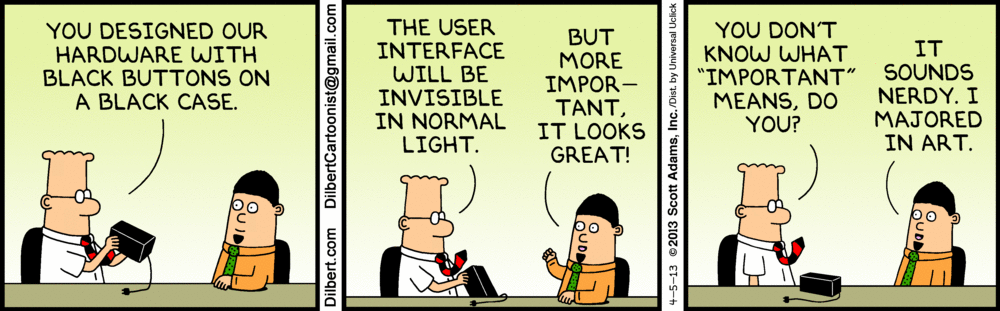

You know that popular quote, "The whole is greater than the sum of its parts."? That's exactly how I feel software engineering is to be. When going into the specifics, it can seem like software engineering is just nothing more than the a fancy word to describe application production. However, when one dives deeper into the specifics, it's much more than that. It opens a world of knowledge that extends beyond just "application building". 

<h1>The Whole</h1>

I just finished a course in software engineering this past fall, and the one thing I'll take away more than anything else is the process. Software engineering isn't merely just a two step plan where you plan and it's done. There are <i>many, many</i> steps that go in between to ensure an application is even good at the most fundamental level. To be honest, for most of the course I didn't think of software engineering more than at face value. It was just a class that focused on web development. However, at the end of course I had to make an actual web application, it all clicked like a puzzle. 

<h2>Putting it Together</h2>

Over the course of the semester, my software engineering class covered an array of topics ranging from coding standards to ethics. At first, I was puzzled on why the class would cover subjects that stray from the path of just "Here's how development works," but now it all makes sense. We have to start one piece, then combine them together to make a picture at the end. 

<h4>A Centralized Approach</h4>
When thinking of how the course initially started, we learned JavaScript, the language of the web. From there, we covered coding standards and why it's important to have a centralized approach to coding. Without such a thing, we'd be left with everyone writing code with their own system of doing things, and no one would be able to read each others work in a collaborative setting. My introduction to coding standards was via ESLint, a popular plugin that's adapted to many coding environments that allows for the user to instantly know when something is wrong by giving an error similar how to google doc's detects a grammar mistake, squiggly lines under the word. 

<h4>Okay, but What's its Purpose?</h4>
Although a heavy focus on the course was on web development and learning how to make visually appealing ui design with a modern tools, an overarching question was left open: Why is what we have there? We covered many websites and tried to reproduce what they did, but when creating one's own website, that same approach is far from optimal. Initially, I did that approach and looked at website similar to what I was going for, but after some critique, I realized what purpose is it for? For example, I had tabs for specific item categories, but on a large scale that isn't feasible. Why would a user be thrown 20 different tabs when there could be a sidebar doing the same job on a single page? Actual good, thoughtful UI design can take a long time to properly think of. I didn't realize how long it would take to properly think of a useful website with a sleek design that serves purpose with every button and layout.

<h4>Now Do it as a Team.</h4>
Group work is notorious for being the bane of a student's existence as they're often thought of either a really good experience or bad experience with no middle ground. However, the purpose of group work in this course is different. Of course there will still be members that will either do their share or work or not, but the methodology behind group work in this course focuses on breaking things down and focusing on tasks and goals at hand. I can use the term "agile project management" or "issue driven management," but it's entirely different explaining and experiencing it. When describing them, it's like settings goals and meeting multiple times a week to assess the process at end and see if said goals have been met. If not, you realign them and readjust the work schedule accordingly. At first, I found it as a roadblock since it hindered how I enjoyed working on things, but as my group project went on, I realized it's a really convenient way of organizing tasks and realigning realistic goals. If a goal isn't met, it isn't the end of world and we have to halt production, it just means we have to work on that next time around and get around to it. There's always room to grow and develop, and this is a physical representation of that ideology. 

<h2>The Puzzle Assembled</h2>
Taking the course has helped me develop as not just a programmer or software developer, but as an individual and team member as well. Of course the technical skills will be invaluable later in the future when I have to apply these in my field of interest, but the ability to be able to mesh as a team and manage the project to reach the end goal is a skill many courses don't teach. Software engineering was more than just a class I had to take as a requirement. It developed into a course that will stick with me.