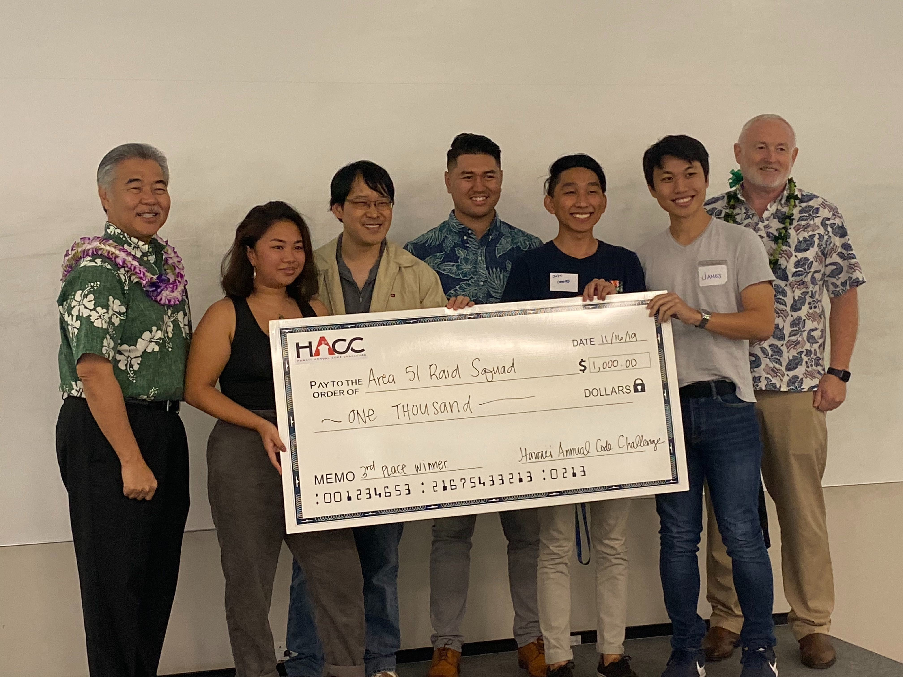

<h1>What is the HACC?</h1>

Every year the government of Hawaii holds a coding challenge called the Hawaii Annual Code Challenge (HACC for short) similar to that of a Hackathon, however, the HACC takes place over roughly 4 weeks. Each new HACC presents new themes and challenges for the contestants to try and tackel. This year, there were challenges presented by: [HGIA](https://hacc.hawaii.gov/2019-challenges/hgia-green-loan-portal/), [ETT/HGG](https://hacc.hawaii.gov/2019-challenges/community-engagement-storytelling/), [HECO](https://hacc.hawaii.gov/2019-challenges/electric-vehicle-charging-analysis/), and the [DOE](https://hacc.hawaii.gov/2019-challenges/doe-aloha-curricular-database/).
 
<h1>What Challenge did I take and how is Volts-Wagon the solution?</h1>

The challenge that my team chose to tackle was the [HECO](https://hacc.hawaii.gov/2019-challenges/electric-vehicle-charging-analysis/) challenge. The challenge called for making a dashboard with real time updating capabilities to inform the company and stakeholders whether a station is working as intended or not. Aside from the basic requirements, anything else was up to each group to be creative and innovative. 

[Volts-Wagon](https://devpost.com/software/volts-wagon) is my team's take on the HECO challenge. Volts-Wagon is a dashboard with real time updates that allows for quick and easy access to all the charging stations, along with map indicators, that informs the users if a charger is working as intended or not. There are real time graphs and charts that allows HECO to see whether stations are congested, down, and working perfectly as intended. Through the hard work of everyone on the team, we were able to take 3rd place. 

Volts-Wagon's Github can be accessed [here](https://github.com/HACC2019/area-51-raid-squad).

<h1>How Volts-Wagon Works</h1>

Volts-Wagon utilizes [ReactJs](https://reactjs.org/), a popular javascript library that is used for building interfaces. Then, our group decided on using Google's [Firebase](https://firebase.google.com/) as the backend to store all of the data provided and constructed. From there, my team was able to incorporate [Google Maps](https://cloud.google.com/maps-platform/) to let HECO see which station correlates to the data. 

<iframe width='560' height='315' src="https://youtube.com/embed/qXhJ4vnYRKc" frameborder="0" allowfullscreen></iframe>

<h1>What I Learned</h1>

From being on the team, I learned a lot about how a team can manage themselves efficiently. Our team had an agile management approach where we met twice weekly and set goals to meet for the next meeting. If those goals weren't met, we realigned the goals and aimed to push them for the next meeting. I ended up doing a lot of front end work, but I also dabbled in back end. My team had two members that were already in the work field, so I got a lot of mentoring done by the two. I was initially on the fence about participating, but I'm glad I did. It was an experience like no other. 

Area 51 Raid Squad. ESKETIT.

